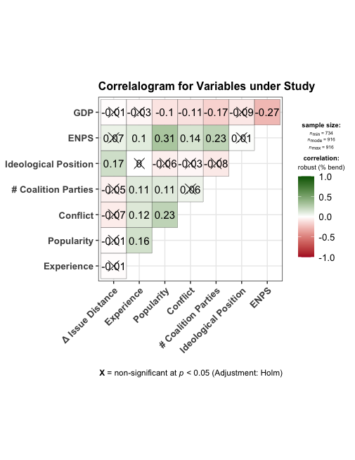

Prepare Integrated Data
================

- DESCRIPTION: Clean and construct measures according to manuscript (pp. XXX)
- CREATES: [Cleaned Data for Analysis](../../data/intermediate/cleaned_dyadic_data.RData)
- DEPENDS: [Raw Manifesto Project Data](../../data/raw/MPDataset_MPDS2019b.csv), [Raw ParlGov Cabinet Data](../../data/raw/view_cabinet.csv), [Raw European Representative Democracy Data](../../data/raw/Bergmann_Muller_Strom_Cabinets-Dataset.csv), [Raw Opinion Poll Data](../../data/raw/polldata_combined.RData)

Content
======

-   [Setup](#setup)
-   [Data](#data)
    -   [Manifesto Project Data](#Manifesto-Project-Data)
    -   [Opinion Poll Data](#Opinion-Poll-Data)
    -   [Cabinet Data](#Cabinet-Data)
    -   [Integrate Datasets](#Integrate-Datasets)
- [Tidy Data](#Tidy-Data)
    -   [Dependent Variable](#Dependent-Variable)
    -   [Independent Variables](#Independent-Variables)

Setup
=====

Load the required packages and source the auxiliary functions from `src/lib/functions.R`:

``` r
source("src/lib/functions.R")
```
Data
====
All raw data files are publicly accessible.


Manifesto Project Data
------------
```r
#Load & Tidy Comparative Manifesto Database
cmp <- read_csv("data/raw/MPDataset_MPDS2019b.csv")

cmp <- cmp %>%
  filter(country == 42 | country == 21 | country == 41 |
         country == 53 | country == 22 | country == 12 |
         country == 14 | country == 11 | country == 13 ) %>% #Select Countries under Study
  mutate( #Calculate Issue Positions
    issue1 = ((per401 + per402 + per407 + per414 + per702) -
                (per404 + per405 + per406 + per409 + per412 + per413 + per415 + per701 + per403)),#pos economy
    issue2 = (per504 + per506) - (per505 + per507),#pos welfare
    issue3 = per108 - per110,#pos welfare
    issue4 = per607 - per608,#pos multiculturalism
    issue5 = ((per103 + per105 + per106 + per107) -
                (per104 + per109)),#pos international affairs
    issue6 = per101 - per102,#pos specialrelations
    issue7 = per203 - per204,#pos constitution
    issue8 = per301 - per302,#pos decentralization
    issue9 = (per601 + per603) - (per602 + per604),#pos traditional
    issue10 = per201 + per202,#sal democracy
    issue11 = per503 + per705 + per706,#sal groups
    issue12 = per303 + per304 + per305,#sal governance
    issue13 = per408 + per411 + per416,#sal economicgrowth
    issue14 = per502,#sal culture
    issue15 = per605,#sal law_order
    issue16 = per606,#sal harmony
    issue17 = per703,#sal farmers
    issue18 = per704,#sal middleclass
    issue19 = per416 + per501,#sal environment
    electionid = interaction(country, edate, drop=TRUE)
  ) %>%
  select(party, country, edate, electionid, rile, issue1, issue2, issue3, issue4, issue5, issue6, issue7, issue8,
         issue9, issue10, issue11, issue12, issue13, issue14, issue15,
         issue16, issue17, issue18, issue19) #Select all relevant variables

cmp <- calculate_sum_difs(cmp)# Create overlap for each pair of parties

cmp <- cmp %>%
  mutate(country = ifelse(substr(electionid_ext,1,2)=="11","Sweden",#Recode country variable
                   ifelse(substr(electionid_ext,1,2)=="12","Norway",
                   ifelse(substr(electionid_ext,1,2)=="13","Denmark",
                   ifelse(substr(electionid_ext,1,2)=="14","Finland",
                   ifelse(substr(electionid_ext,1,2)=="22","Netherlands",
                   ifelse(substr(electionid_ext,1,2)=="21","Belgium",
                   ifelse(substr(electionid_ext,1,2)=="41","Germany",
                   ifelse(substr(electionid_ext,1,2)=="42","Austria",
                   ifelse(substr(electionid_ext,1,2)=="53","Ireland",NA))))))))),
         electiondate = as.Date(str_sub(electionid_ext,4,13),format="%d/%m/%Y"),
         id2 = paste(electionid_ext, party1, party2, sep="."),
         party1=recode(party1,#Recode merger parties
                       `21914` = 21917,
                       `21221` = 21321,
                       `23111` = 23113,
                       `23112` = 23113,
                       `41112` = 41111,
                       `41113` = 41111,
                       `41223` = 41221,
                       `41222` = 41221,
                       `21221` = 21321),
         party2=recode(party2,#Recode merger parties
                       `21914` = 21917,
                       `21221` = 21321,
                       `23111` = 23113,
                       `23112` = 23113,
                       `41112` = 41111,
                       `41113` = 41111,
                       `41223` = 41221,
                       `41222` = 41221,
                       `21221` = 21321),
         id = paste(country,substr(electiondate,1,4),party1, sep="-")) %>%
  select(country, electiondate, electionid_ext, id, id2, party1, party2, sum_difs,
         rile_party1, rile_party2, rile_difs)
```

Opinion Poll Data
------------
``` r
#Load & Tidy poll data from Van Der Velden (2015), Jennings and Wlezien (2014) and Askham-Christensen (2012)
load("data/raw/polldata_combined.RData")

polls <- data %>%
  pivot_longer(cols = `party 1`:`party 42`,
               names_to = "party",
               values_to = "polls") %>%
  filter(country == "Austria"     | country == "Belgium" | country == "Denmark" |
         country == "Finland"     | country == "Germany" | country == "Ireland" |
         country == "Netherlands" | country == "Norway"  | country == "Sweden") %>%
  mutate(year = as.character(year),
         month = as.character(month),
         month = ifelse(nchar(month)==1, paste0("0",month), month),
         date = paste("01", month, year, sep="/"),
         date = as.Date(date, format = "%d/%m/%Y"))

#add cmp code names to party
party <- row.names(cmpcode)
for(i in 1:length(party)){
  for(j in 1:length(unique(polls$country))){
    select <- which(polls$party==row.names(cmpcode)[i] & polls$country==unique(polls$country)[j])
    tmp <- as.character(unique(polls$country)[j])
    polls$party[select] <- cmpcode[row.names(cmpcode)[i], tmp]
  }
}

polls <- polls %>%
  mutate(party = as.numeric(party),
         party = recode(party,#Recode merger parties
                       `21914` = 21917,
                       `21221` = 21321,
                       `23111` = 23113,
                       `23112` = 23113,
                       `41112` = 41111,
                       `41113` = 41111,
                       `41223` = 41221,
                       `41222` = 41221,
                       `21221` = 21321),
         country_code = substr(party,1,2),
         id = paste(country, date, sep=".")) %>%
  drop_na(party) %>%
  distinct_all() %>%
  add_column(event = NA) %>%
  arrange(country_code)

#add election dates
id <- read_csv(file = "data/raw/election_id.csv")
for(i in 1:dim(id)[1]){
    if(i==1){
      start <- i
      }
    else{
      start <- max(which(polls$id==id$id[(i-1)]))+1
    }
    end <- max(which(polls$id==id$id[i]))
    polls$event[start:end] <- str_split(id$id[i], "\\.")[[1]][2]
}

polls <- polls %>%  
  drop_na(event) %>%
  mutate(event = as.Date(event),
         month_teller = abs(event-date),#add teller to select 6 months before election
         month_teller = round(as.numeric(month_teller)/365 *12,0),
         event = paste(country, event, sep = ".")) %>%
  add_column(mean_polls = 0,
             mean_polls2 = 0) %>%
  drop_na(polls)

#Average polls of 6 months prior to election  
for(i in 1: length(unique(polls$event))){
  tmp <- unique(polls$event)
  party <- unique(polls$party[which(polls$event==tmp[i])])
  for(j in 1: length(party)){
    tmpp <- polls[which(polls$event==tmp[i] & polls$month_teller < 7 & polls$month_teller > 0 & polls$party==party[j]), "polls"]
    if(dim(tmpp)[1]>0){
    polls$mean_polls[which(polls$event==tmp[i])] <- round(sum(tmpp, na.rm=T)/(6 - length(which(is.na(tmpp)))),2)}
  }
}

#Average polls of 12 months prior to election  
for(i in 1: length(unique(polls$event))){
  tmp <- unique(polls$event)
  party <- unique(polls$party[which(polls$event==tmp[i])])
  for(j in 1: length(party)){
    tmpp <- polls[which(polls$event==tmp[i] & polls$month_teller < 13 & polls$month_teller > 0 & polls$party==party[j]), "polls"]
    if(dim(tmpp)[1]>0){
      polls$mean_polls2[which(polls$event==tmp[i])] <- round(sum(tmpp, na.rm=T)/(12 - length(which(is.na(tmpp)))),2)}
  }
}

polls <- polls %>%
  filter(id == event) %>%
  mutate(id = paste(country,year,party, sep="-")) %>%
  select(id, mean_polls, mean_polls2)
```

Cabinet Data
------------
Integrate [Raw ParlGov Cabinet Data](../../data/raw/view_cabinet.csv), [Raw European Representative Democracy Data](../../data/raw/Bergmann_Muller_Strom_Cabinets-Dataset.csv), and [Termination Cause Data](../../data/raw/imputing_termination_cause.csv)  

```r
#Load & tidy Parlgov Data and with Coalition Data Set of Bergmann et al.
parlgov <- read_csv(file = "data/raw/view_cabinet.csv")  %>%
  filter(country_name == "Austria"     | country_name == "Belgium" | country_name == "Denmark" |
         country_name == "Finland"     | country_name == "Germany" | country_name == "Ireland" |
         country_name == "Netherlands" | country_name == "Norway"  | country_name == "Sweden") %>%
  select(country_name_short, election_date, start_date, cabinet_name, caretaker, cabinet_party, prime_minister,
         seats, election_seats_total, party_name_short, party_name_english, party = party_id) %>%
  mutate(party = recode(party,#Recode merger parties
                        `1113` = 1029,
                        `1487` = 1029,
                        `255` = 772),
         cabinet_name = ifelse(start_date=="1932-05-20", "Dollfuss",
                        ifelse(start_date=="1920-03-29", "Moeller I",
                        ifelse(start_date=="1928-06-29", "Moeller II",
                        ifelse(start_date=="1930-03-30", "Breuning I",
                        ifelse(start_date=="1930-10-16", "Breuning II",
                        ifelse(start_date=="1930-12-05", "Breuning III",
                        ifelse(start_date=="1931-10-10", "Breuning IV",
                        ifelse(start_date=="1932-12-14", "Kivimaki I",
                        ifelse(start_date=="1933-07-01", "Kivimaki II", cabinet_name))))))))),
         id3 = paste(party_name_short,country_name_short, sep="."))

#add cmp code to parlgov
ids <- read_csv(file = "data/raw/view_party.csv") %>%
  mutate(id3 = paste(party_name_short, country_name_short, sep="."),
         cmp = recode(cmp,#Recode merger parties
                        `21914` = 21917,
                        `21221` = 21321,
                        `23111` = 23113,
                        `23112` = 23113,
                        `41112` = 41111,
                        `41113` = 41111,
                        `41223` = 41221,
                        `41222` = 41221,
                        `21221` = 21321))%>%
  select(id3, cmp_id = cmp) %>%
  drop_na(cmp_id) %>%
  distinct_all()

parlgov <- full_join(parlgov, ids, by="id3") %>%
  drop_na(cmp_id) %>%
  distinct_all() %>%
  drop_na(country_name_short)

coalitiondata <- read_delim(file = "data/raw/Bergmann_Muller_Strom_Cabinets-Dataset.csv", delim = ";")  %>%
  filter(v001e == 1 | v001e==2 | v001e==3 | v001e==4| v001e==6 | v001e==9 |
         v001e == 12| v001e==13| v001e==16) %>%
  select(cabinet_name = v003e, no_cabinetparties = v320e,
         govtype = v329e, bargaining_power = v310e ) %>%
    mutate(cabinet_name = as.character(cabinet_name),
           cabinet_name = recode(cabinet_name,
                               "Hansson" = "Hansson I",
                               "F\xe4lldin I" = "Falldin I",
                               "F\xe4lldin II" = "Falldin II",
                               "F\xe4lldin III" = "Falldin III",
                               "Bondevik" = "Bondevik I",
                               "de Valera VI" = "Valera VI",
                               "de Valera VII" = "Valera VII",
                               "de Valera VIII" = "Valera VIII",  
                               "FitzGerald II"="Fitzgerald II",                     
                               "Schroeder" = "Schroeder I",
                               "Kohl V"="Kohl IV",
                               "Kohl VI"="Kohl V",
                               "Lipponen" = "Lipponen I",
                               "von Fieandt" = "Fieandt",
                               "T\xf6rngren" = "Torngren",
                               "Karjalainen Iia" = "Karjalainen II",
                               "Karjalainen Iib" = "Karjalainen III",
                               "Sukselainen Ib"= "Sukselainen II",   
                               "Sukselainen Ic"= "Sukselainen I",              
                               "Sukselainen IV"=  "Miettunen I",                 
                               "Holkeri a"="Holkeri I",
                               "Holkeri b"="Holkeri II",            
                               "Aho a"="Aho I",                 
                               "Aho b"="Aho II",
                               "Paasikivi III"="Paasikivi II",
                               "Rasmussen IV" = "Rasmussen N IV",
                               "Rasmussen I" = "Rasmussen N I",
                               "Rasmussen III" = "Rasmussen N III",         
                               "Rasmussen II" = "Rasmussen N II",    
                               "Schl\xfcter I" = "Schluter I",
                               "Schl\xfcter II" = "Schluter II",
                               "Schl\xfcter III" = "Schluter III",
                               "Schl\xfcter IV" = "Schluter IV",
                               "Schl\xfcter V" = "Schluter V",
                               "Spaak" = "Spaak I",
                               "Dehaenen I"="Dehaene I",
                               "Van den Boeynants I"="Vanden Boeynants I",                
                               "Van den Boeynants II"="Vanden Boeynants II",     
                               "Tindemans"="Tindemans I",             
                               "Eyskens" = "Eyskens G I",
                               "Eyskens II" = "Eyskens G II",
                               "Eyskens III"="Eyskens G III",          
                               "Eyskens V"="Eyskens G V",            
                               "Eyskens IV"="Eyskens G IV",
                               "M Eyskens" = "Eyskens M",
                               "Van Houtte" = "Houtte",
                               "Klima" = "Klima I",   
                               "Vranizky V"="Vranitzky V"))

cabinet_data <- left_join(x = parlgov, y = coalitiondata, by="cabinet_name") %>%
  mutate(start_date = as.Date(start_date),
         election_date = as.Date(election_date),
         end_date = paste(substr(start_date,1,4), substr(start_date,6,7), substr(start_date,9,10), sep="-"),
         id3 = paste(id3, cabinet_name, sep="."))

#Add termination causes based on Bergmann, Mueller & Strom book
#Strøm, Kaare; Müller, Wolfgang C. and Bergman, Torbjörn eds. (2008). Cabinets and Coalition Bargaining: The Democratic Life Cycle in Western Europe. Oxford: Oxford University Press. (Paperback 2010).
termination <- read_csv(file = "data/raw/Termination_causes.csv") %>%
  select(cabinet_name = v003x, termination_cause = v217y)
cabinet_data <- left_join(x = cabinet_data, y = termination, by = "cabinet_name")

cabinet_data <- slide(data = cabinet_data, Var = "cabinet_name", TimeVar = "start_date", GroupVar = "cmp_id", NewVar = "cabinet_name1")
cabinet_data <- slide(data = cabinet_data, Var = "caretaker", TimeVar = "start_date", GroupVar = "cmp_id", NewVar = "caretaker1")
cabinet_data <- slide(data = cabinet_data, Var = "cabinet_party", TimeVar = "start_date", GroupVar = "cmp_id", NewVar = "cabinet_party1")
cabinet_data <- slide(data = cabinet_data, Var = "prime_minister", TimeVar = "start_date", GroupVar = "cmp_id", NewVar = "prime_minister1")
cabinet_data <- slide(data = cabinet_data, Var = "seats", TimeVar = "start_date", GroupVar = "cmp_id", NewVar = "seats1")
cabinet_data <- slide(data = cabinet_data, Var = "election_seats_total", TimeVar = "start_date", GroupVar = "cmp_id", NewVar = "election_seats_total1")
cabinet_data <- slide(data = cabinet_data, Var = "termination_cause", TimeVar = "start_date", GroupVar = "cmp_id", NewVar = "termination_cause1")
cabinet_data <- slide(data = cabinet_data, Var = "no_cabinetparties", TimeVar = "start_date", GroupVar = "cmp_id", NewVar = "no_cabinetparties1")
cabinet_data <- slide(data = cabinet_data, Var = "govtype", TimeVar = "start_date", GroupVar = "cmp_id", NewVar = "govtype1")
cabinet_data <- slide(data = cabinet_data, Var = "end_date", TimeVar = "start_date", GroupVar = "cmp_id", NewVar = "end_date1", slideBy = 1)

cabinet_data <- cabinet_data %>%
  mutate(match_id = paste(election_date, cmp_id, sep="."),
         end_date = as.Date(end_date1),
         duration_months = round(as.numeric((end_date - start_date))/365*12,0)) %>%
  select(match_id, country_name = country_name_short, election_date, start_date, end_date, duration_months, cmp_id, party,
         cabinet_party=cabinet_party1, prime_minister=prime_minister1, cabinet_name=cabinet_name1,
         no_cabinetparties=no_cabinetparties1, caretaker=caretaker1, govtype=govtype1,
         termination_cause=termination_cause1, seats=seats1, tot_seats = election_seats_total1)%>%
  add_column(tot_months = 0)

party <- unique(cabinet_data$cmp_id)
for(i in 1:length(party)){
  select <- which(cabinet_data$cmp_id==party[i])
  if(length(select)==1){
    cabinet_data$tot_months[select] = cabinet_data$duration_months[select]
  }
  if(length(select)>1){
  cabinet_data$tot_months[select] <- cumsum(na.omit(cabinet_data$duration_months[select]))
  }
}
```

Integrate Datasets
------------
``` r
cmp <- cmp %>%
  left_join(y = polls, by = "id") %>%
  select(country:electionid_ext, id2, party1:rile_difs, polls_party1 = mean_polls, polls2_party1 = mean_polls2) %>%
  mutate(id = paste(country,substr(electiondate,1,4),party2, sep="-"))
cmp <- left_join(x = cmp, y = polls, by = "id")

cmp <- cmp %>%
  mutate(pcombi1 = paste0(party1, party2),
         pcombi2 = paste0(party2, party1),
         unique_pcombi = as.numeric(pcombi1==pcombi2)) %>%
  filter(unique_pcombi==0) %>%
  select(country:party2, pcombi=pcombi1, sum_difs:polls2_party1, polls_party2 = mean_polls, polls2_party2 = mean_polls2) %>%
  mutate(match_id = paste(electiondate, party1, sep="."))

df <- left_join(cmp, cabinet_data, by = "match_id") %>%
  mutate(match_id = paste(electiondate, party2, sep=".")) %>%
  select(match_id, country:electiondate, start_date,
         electionid_ext, party = party1, partner = party2, pcombi, sum_difs,
         rile_party = rile_party1, rile_partner=rile_party2, rile_difs, polls_party = polls_party1,
         polls_partner = polls_party2, polls2_party = polls2_party1, polls2_partner = polls2_party2,
         cabinet_party, pm_party = prime_minister, seats_party = seats)

df <- left_join(df, cabinet_data, by = "match_id") %>%
  select(country:electiondate, start_date = start_date.x, end_date, electionid_ext,
         party = party.x, partner:polls2_partner, cabinet_party = cabinet_party.x,
         cabinet_partner = cabinet_party.y, pm_party, pm_partner = prime_minister, seats_party,
         seats_partner = seats, tot_seats, cabinet_name:termination_cause, duration_months, tot_months) %>%
  mutate(first_election = ifelse(electionid_ext=="11.17/09/1944",1,
                          ifelse(electionid_ext=="12.08/10/1945",1,
                          ifelse(electionid_ext=="13.30/10/1945",1,
                          ifelse(electionid_ext=="14.18/03/1945",1,
                          ifelse(electionid_ext=="21.17/02/1946",1,
                          ifelse(electionid_ext=="22.17/05/1946",1,
                          ifelse(electionid_ext=="41.14/08/1949",1,
                          ifelse(df$electionid_ext=="42.09/10/1949",1,
                          ifelse(electionid_ext=="53.04/02/1948",1,0))))))))),
         termination_cause = replace_na(termination_cause, 0),
         unique_id = paste(electionid_ext, pcombi, sep=".")) %>%
  filter(!duplicated(unique_id)) %>%
  select(-unique_id) %>%
  filter(first_election==0) %>%
  select(-first_election)
```


Tidy Data
====

``` r
# Mutate data
df <- slide(data = df, Var = "sum_difs", TimeVar = "electiondate", GroupVar = "pcombi", NewVar = "l_sum_difs")
df <- df %>%
  mutate(pcombi = as.numeric(pcombi),
         year = substr(electiondate, 1,4),
         year = as.numeric(year),
         d_issue_distance = sum_difs-l_sum_difs,
         cabinet_pair = cabinet_party + cabinet_partner,
         conflict = recode(termination_cause, `2`= 0),
         sum_polls = polls_party + polls_partner,#and voluntary early & regular end of term are 1 category
         popularity = ifelse(sum_polls==0, NA, log((polls_party + polls_partner)/(seats_party + seats_partner))),
         popularity2 =  ifelse(sum_polls==0, NA, log((polls2_party + polls2_partner)/(seats_party + seats_partner))),
         rile = ifelse(rile_party<0 & rile_partner<0,0,
                ifelse(rile_party>0 & rile_partner>0,0,1))) %>%#rile:  being on other side = 1, same side = 0
  add_column(rile_mean = 0,
             rile_median = 0)

#calculate mean and median per election cycle
cutoffs_rile <- df %>%
  group_by(electionid_ext) %>%
  summarise(rile_mean = mean(rile_party + rile_partner, na.rm = T)/2,
            rile_median = median(rile_party + rile_partner, na.rm = T)/2)

for(i in 1:dim(cutoffs_rile)[1]){
  df$rile_mean[df$electionid_ext==cutoffs_rile$electionid_ext[i]] <- cutoffs_rile$rile_mean[i]
  df$rile_median[df$electionid_ext==cutoffs_rile$electionid_ext[i]] <- cutoffs_rile$rile_median[i]
}

df <- df %>%
  mutate(rile_mean = ifelse(rile_party<rile_mean & rile_partner<rile_mean,0,
                     ifelse(rile_party>rile_mean & rile_partner>rile_mean,0,1)),
         rile_median = ifelse(rile_party<rile_median & rile_partner<rile_median,0,
                       ifelse(rile_party>rile_median & rile_partner>rile_median,0,1)))

#calculate experience
tmp <- tibble(pairs=unique(df$pcombi),
              select = 0)
for(i in 1:length(pairs)){
  tmp$select[i] <- ifelse(length(which(df$pcombi==tmp$pairs[i] & df$cabinet_pair==1))>0,1,0)
}
select <- tmp$pairs[which(tmp$select==1)]
tmp <- df[,c("duration_months", "pcombi", "cabinet_name", "start_date")]
tmp <- slide(tmp, Var = "duration_months", TimeVar = "start_date", GroupVar = "pcombi", NewVar = "l_duration")
tmp <- tmp %>%
  mutate(l_duration = replace_na(l_duration,0),
    experience = duration_months + l_duration,
    match_id = paste(cabinet_name, pcombi, sep=".")) %>%
  select(match_id, experience)

df <- df%>%
  mutate(match_id = paste(cabinet_name, pcombi, sep=".")) %>%
  left_join(y=tmp, by="match_id") %>%
  drop_na(start_date) %>%
  select(match_id, country:rile_median,
         experience) %>%
  mutate(experience = replace_na(experience, 0),
         experience = round(experience/tot_months,2))

#add controls
controls <- read_csv(file = "data/raw/controls.csv") %>%
  mutate(id = paste(counrty, year, sep = "."),
         type_conflict = replace_na(type_conflict,0)) %>%
  select(enps:id)

df <- df %>%
  mutate(id = paste(country, year, sep=".")) %>%
  left_join(y = controls, by = "id") %>%
  mutate(year = ifelse(electionid_ext=="13.22/09/1953", 1954,# For tscs reasons, double election years can't be dealed with
                ifelse(electionid_ext=="53.24/11/1982", 1983,# (Denemarken 1953, iceland 1969 en Ierland 1982)
                ifelse(electionid_ext=="15.25/10/1959", 1960, year))),# therefore 2nd election is coded as year later
         pec_bergman = ifelse(country=="Norway" & year == 1965, 1,
                       ifelse(country=="Norway" & year == 1981, 1,
                       ifelse(country=="Norway" & year == 1989, 1,
                       ifelse(country=="Norway" & year == 2001, 1,
                       ifelse(country=="Sweden" & year == 2006, 1,
                       ifelse(country=="Ireland" & year == 2007, 1, 0))))))) #Control for pre-coalition agreements Bergman

#Control for pre-coalition agreements Golder's BJPS 2006
pec <- read_csv(file = "data/raw/PEC_Golder2006.csv") %>%
  mutate(id = paste(country, year, sep=".")) %>%
  select(pec_golder = pec, id)

df <- df %>%
  left_join(y = pec, by = "id") %>%
  filter(cabinet_pair>0) %>%
  mutate(unique_id = paste(electionid_ext, pcombi, sep="."),
         cabinet_pair = recode(cabinet_pair,
                               `1`=0,
                               `2`=1)) %>%
  filter(!duplicated(unique_id)) %>%
  select(country:electionid_ext, year, party:pcombi, sum_difs, l_sum_difs,
         d_issue_distance, seats_party, seats_partner,tot_seats, polls_party:polls2_partner,
         popularity,popularity2, cabinet_name:termination_cause, conflict, cabinet_pair, duration_months,
         tot_months, experience, rile_party:rile_difs, rile:rile_median, enps:pec_golder) %>%
  drop_na(popularity)

#Save Dataset
save(df, file="data/intermediate/cleaned_dyadic_data.RData")

#Check Correlations
# as a default this function outputs a correlation matrix plot
df%>%
  select(d_issue_distance, experience, popularity,
         conflict, no_cabinetparties,
         rile, enps, gdp) %>%
  ggstatsplot::ggcorrmat(
    type = "robust", # correlation method
    sig.level = 0.05, # threshold of significance
    p.adjust.method = "holm", # p-value adjustment method for multiple comparisons
    cor.vars = c(d_issue_distance:gdp), # a range of variables can be selected
    cor.vars.names = c(
      "Δ Issue Distance", # variable names
      "Experience", # variable names
      "Popularity",
      "Conflict",
      "# Coalition Parties",
      "Ideological Position",
      "ENPS",
      "GDP"),
    matrix.type = "upper", # type of visualization matrix
    colors = c("#B2182B", "white", "darkgreen"),
    title = "Correlalogram for Variables under Study",
    lab_size = 2
  )

```



Dependent Variable
 -------
 ``` r
##  Dependent Variable
df %>%
  ggplot(aes(x = d_issue_distance)) +
  geom_histogram(fill = "gray85", colour = "black", binwidth = 10) +
  theme_classic() +
  theme(plot.title = element_text(hjust = 0.5)) +
  labs(x = "Range: -73.1 - 71.4", y="", title = "Δ Issue Distance \n Mean: -1.44, Standard Deviation: 20.02")
```


Independent Variables
-------
- Popularity (**H1a**)
- Experience (**H1b**)
- Conflict(**H1c**)
- Being a Government Proto-Coalition (**H1**)
- Number of Coalition Parties (_control variable_)
- Effective Number of Parties (_control variable_)
- % Change GDP Growth (_control variable_)
- Being on the Same Ideological Side (_control variable_)

 ``` r
##  Independent Variables
rbind(tibble(
  freq = c(round(df$popularity,2), round(df$experience, 2), df$no_cabinetparties,
           round(df$enps,2), round(df$gdp,2)),
  id = c(rep("Popularity \n Mean: -2.15, Standard Deviation: 1.48 \n Range: -8.13 - 1.72", length(round(df$popularity,2))),
         rep("Experience \n Mean: 0.16, Standard Deviation: 0.19 \n Range: 0 - 1", length(round(df$experience, 2))),
         rep("Number of Coalition Parties \n Mean: 2.53, Standard Deviation: 1.08 \n Range: 1 - 5", length(round(df$no_cabinetparties, 2))),
         rep("Effective Number of Parties (ENPS) \n Mean: 74.61, Standard Deviation: 7.04 \n Range: 57.75 - 88.14", length(round(df$enps, 2))),
         rep("% Change GDP Growth \n Mean: 1.91, Standard Deviation: 2.65 \n Range: -4.98 - 6.42", length(round(df$gdp, 2)))))) %>%
  ggplot(aes(x = freq)) +
  geom_histogram(fill = "gray85", colour = "black") +
  theme_classic() +
  theme(plot.title = element_text(hjust = 0.5)) +
  facet_wrap(~ id, ncol = 3,scales = "free")  +
  labs(x="",y="", title = "Continues Independent Variables")

rbind(tibble(
  value = c("No Conflict","Conflict","Not a Government Proto-Coalition",
            "Government Proto-Coalition","Same Ideological Side",
            "Opposite Side"),
  freq = c(table(df$conflict2),table(df$cabinet_pair2),table(df$rile2)),
  id = c(rep("Conflict \n Median: No Conflict", 2),
         rep("Being a Government Proto-Coalition \n Median: Not a Government Proto-Coalition", 2),
         rep("Being on the Same Ideological Side \n Median: Same Ideological Side", 2)))) %>%
  ggplot(aes(x = value, y = freq)) +
  geom_col(fill = "gray85", colour = "black" ) +
  theme_classic() +
  theme(plot.title = element_text(hjust = 0.5)) +
  facet_wrap(~ id, ncol = 3,scales = "free")  +
  labs(x="",y="", title = "Dichotomous Independent Variables")
```


